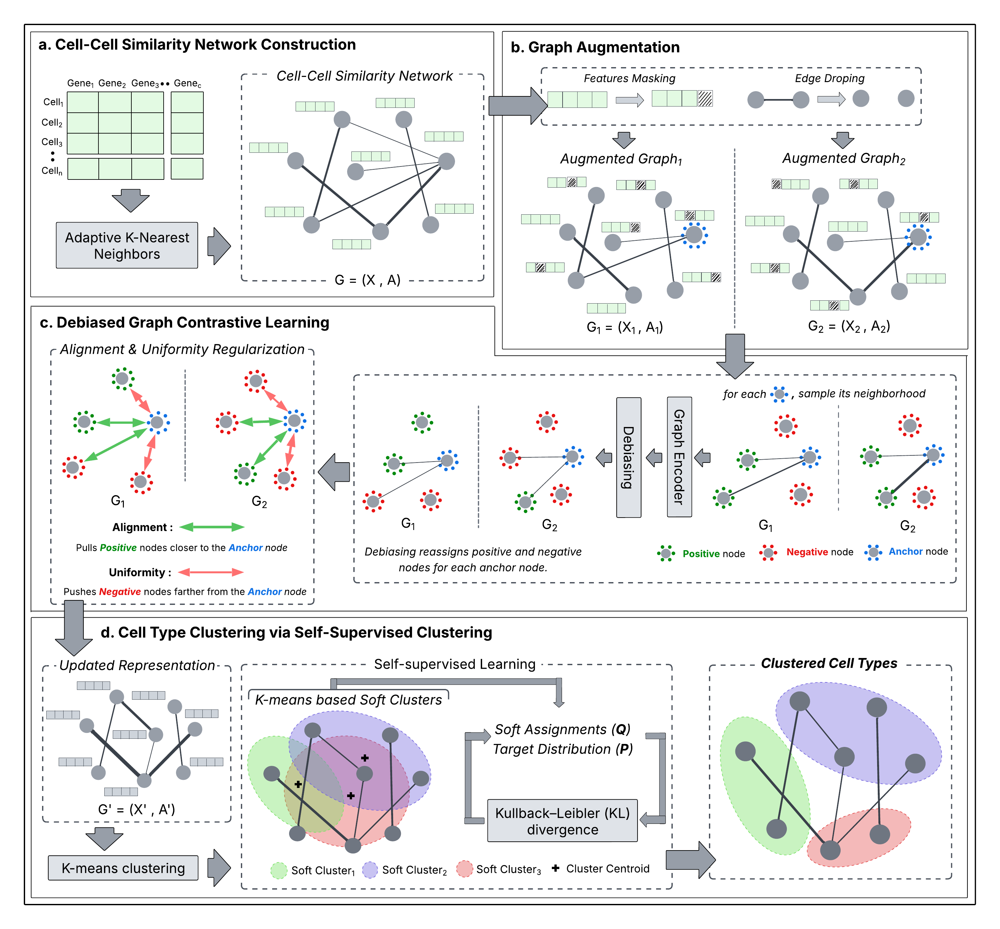

# **scAURA**  
## scAURA: Alignment- and Uniformity-based Graph Debiased Contrastive Representation Architecture for Self-Supervised Clustering of Single-Cell Transcriptomics.

## Overview

**scAURA** is a unified framework for single-cell RNA sequencing (scRNA-seq) clustering that integrates **graph debiased contrastive learning** with **self-supervised clustering** to robustly identify cellular heterogeneity under high dimensionality, sparsity, and technical noise.

### Key Contributions of scAURA
- **Adaptive k-nearest neighbor (kNN) graph construction** that dynamically adjusts neighborhood sizes, enabling improved detection of rare and small cell populations  
- **Noise-robust cell–cell relationship modeling** by combining shared nearest neighbor (SNN)–based edge weighting with a debiased graph contrastive learning objective  
- **Modified contrastive loss with alignment and uniformity**, ensuring biologically similar cells are embedded closer together while maintaining a well-dispersed latent space  
- **Self-supervised clustering module** that iteratively refines cluster assignments during representation learning  
- **Consistent state-of-the-art performance** across diverse scRNA-seq datasets, including robustness to high dropout rates and extreme sparsity, with demonstrated utility for biological discovery such as identifying novel marker genes and regulatory signals  

Overall, scAURA provides a noise-aware, and biologically meaningful framework for accurate single-cell clustering and downstream analysis.

##  Model Architecture

  

 
